#Was部署指南
本指南主要介绍如下操作

 - 切换主从环境
 - 部署环境（打补丁）
 - 补丁回滚

##环境和工具

部署Was所需工具是Xmanager Enterprise 4，安装文件和密钥链接：<a href="xmanager.zip?raw=true">点击下载</a>

###安装工具

安装工具的时候会让你输入密钥的，如果不输入可能部分功能会看不到，密钥在下载的压缩包里面有。

###基本操作

工具安装好了，在桌面找到 `Xmanager Enterprise 4` 图标（如图），双击打开。

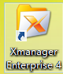

之后找到 `Xbrowser` 图标（如图），双击打开工具。

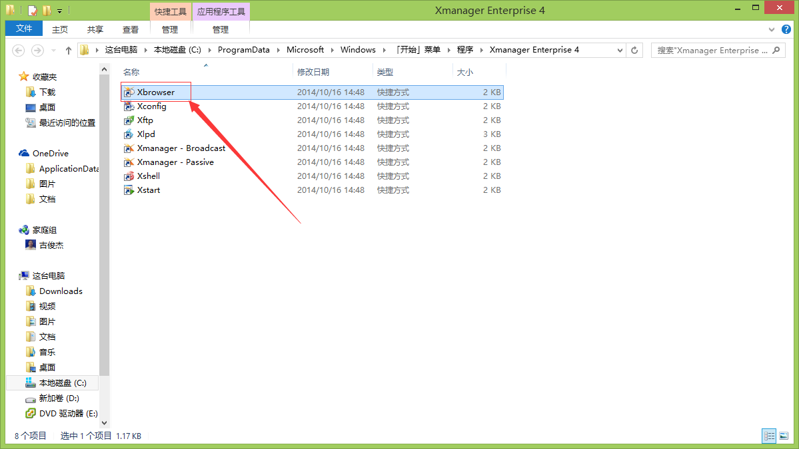

后面的操作请按下面的图片操作

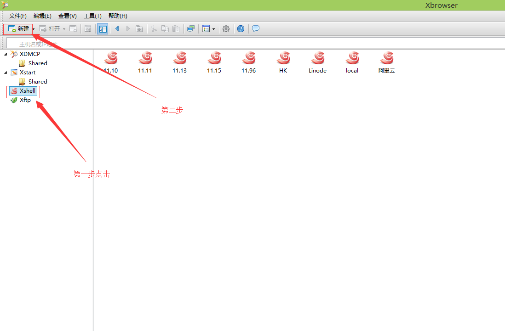
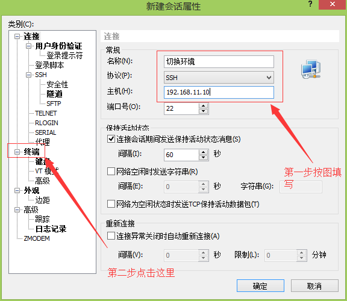
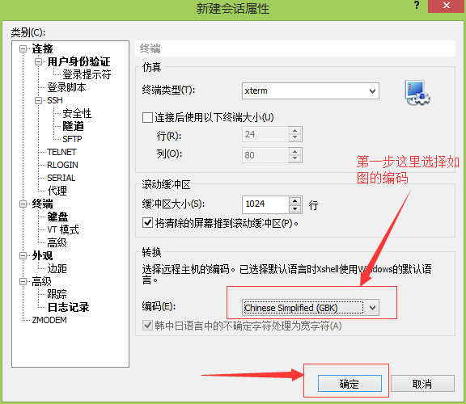

重复上面的步骤创建下面两个连接

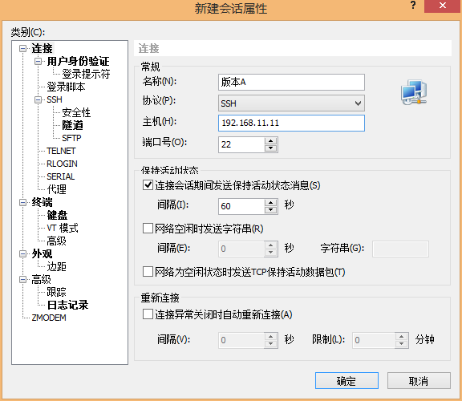
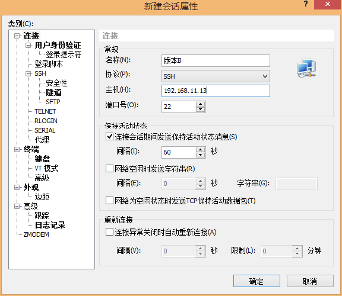
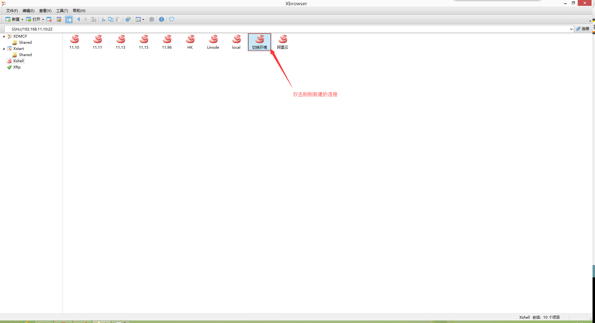
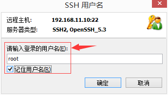
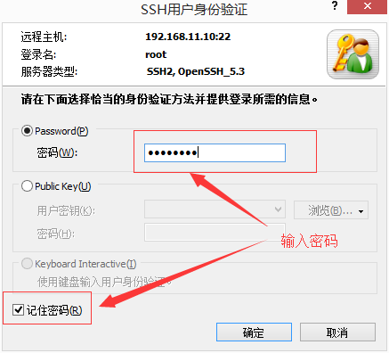
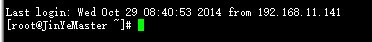

登陆成功之后，后面的命令如无特别说明都是在此状态下执行。

##切换环境

输入下面的命令并回车查看当前环境是哪个版本

`cat /opt/IBM/HTTPServer/Plugins/config/webserver/plugin-cfg.xml | grep Hostname`

上面命令会返回类似下图的内容，根据图片说明就可以判断是A版还是B版（目前只有两个版本）。

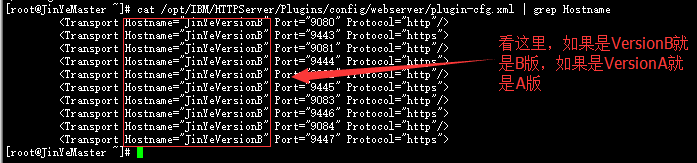

知道当前是哪个版本之后就可以进行切换到另外一个版本，根据版本对应执行下面脚本（只需要二选一执行一种就行了）。

当前版本是A版要切换到B版：

`\cp -f /opt/IBM/HTTPServer/Plugins/config/webserver/plugin-cfg-b.xml /opt/IBM/HTTPServer/Plugins/config/webserver/plugin-cfg.xml`

当前版本是B版要切换到A版：

`\cp -f /opt/IBM/HTTPServer/Plugins/config/webserver/plugin-cfg-a.xml /opt/IBM/HTTPServer/Plugins/config/webserver/plugin-cfg.xml`

切换完之后，要执行下面的命令让配置生效。

`/opt/IBM/HTTPServer/bin/apachectl -k restart`

最后打开NC客户端测试一下是否正常运行。

##部署环境（打补丁）

##补丁回滚

