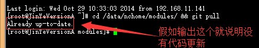
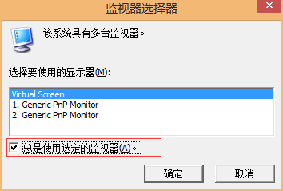
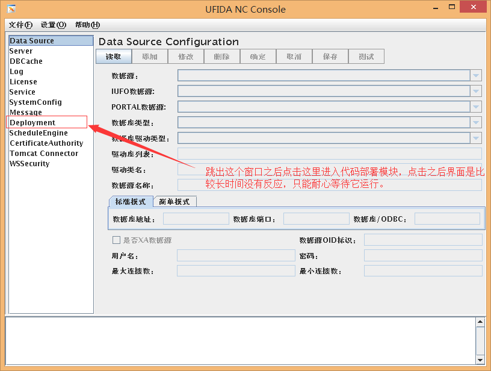
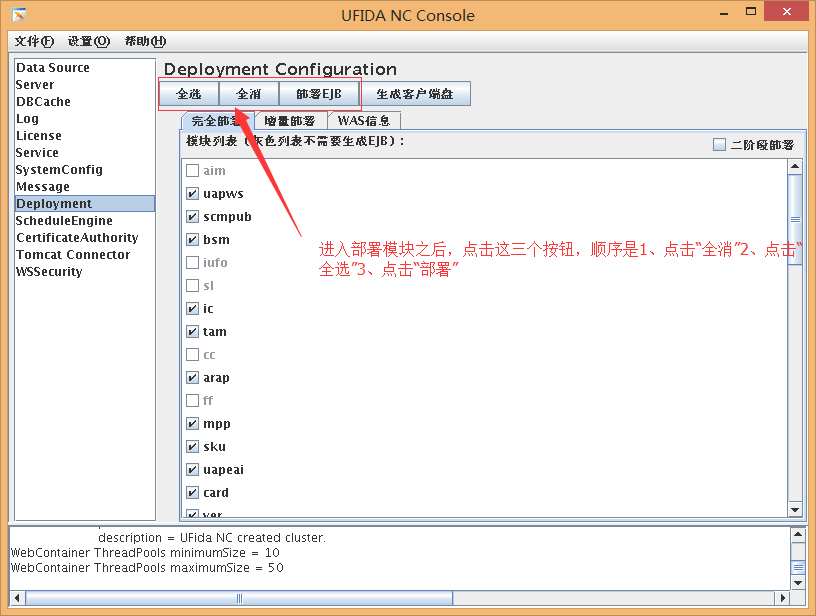
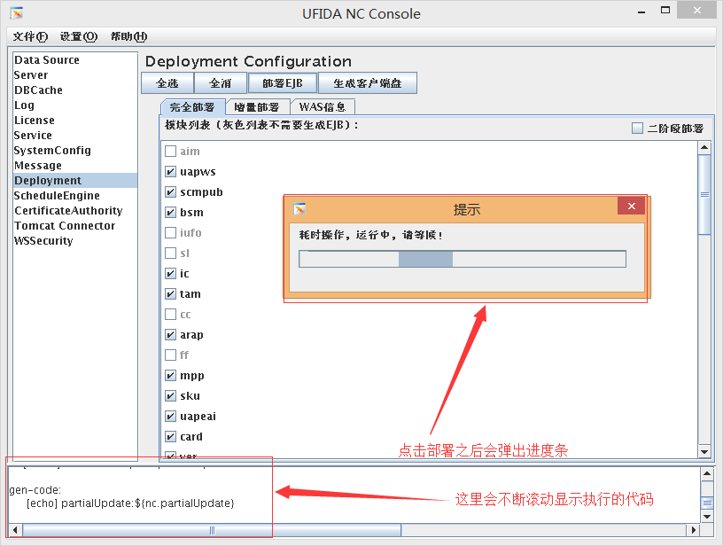
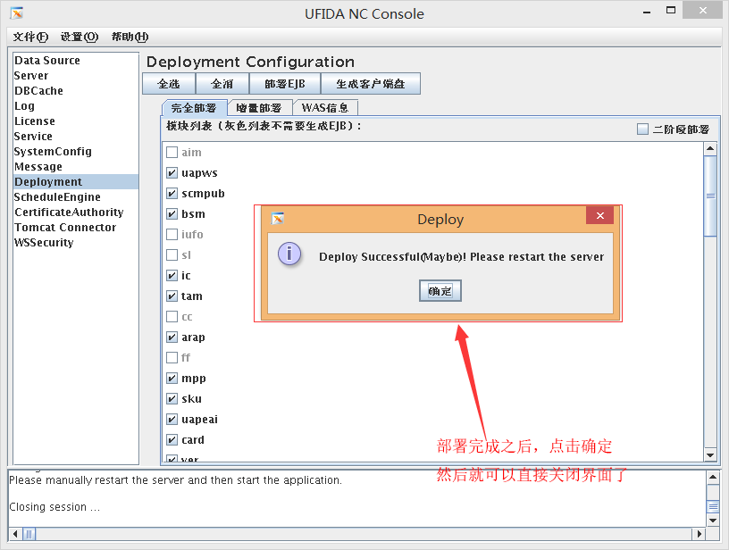
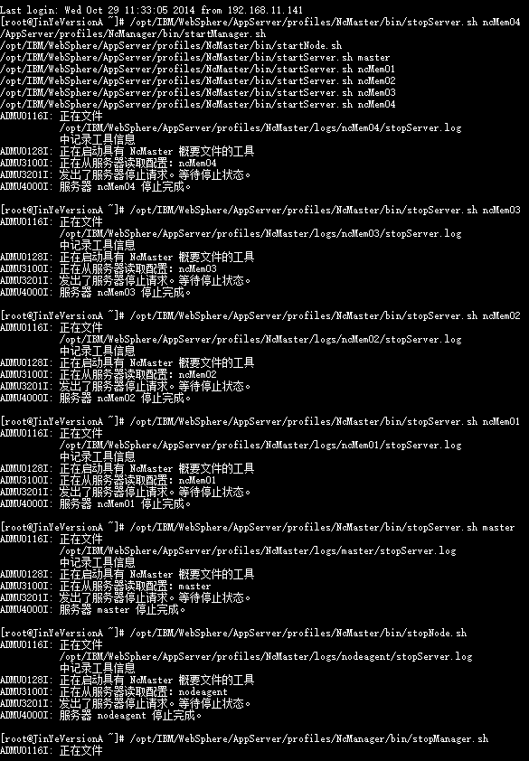
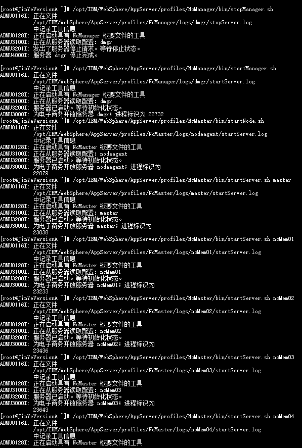
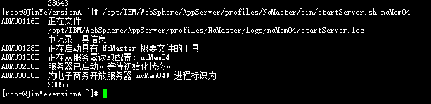
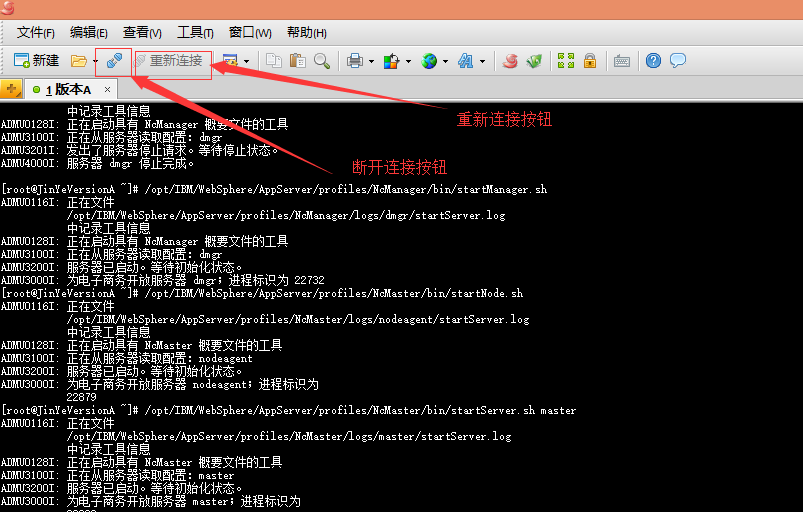

#Was部署指南
本指南主要介绍如下操作

 - [环境和工具](#abc)
 - [切换环境](#bbc)
 - 部署环境（打补丁）
 - 补丁回滚

##[环境和工具](id:abc)

部署Was所需工具是Xmanager Enterprise 4，安装文件和密钥链接：<a href="xmanager.zip?raw=true">点击下载</a>

###安装工具

安装工具的时候会让你输入密钥的，如果不输入可能部分功能会看不到，密钥在下载的压缩包里面有。

###基本操作

工具安装好了，在桌面找到 `Xmanager Enterprise 4` 图标（如图），双击打开。


之后找到 `Xbrowser` 图标（如图），双击打开工具。


后面的操作请按下面的图片操作


重复上面的步骤创建下面两个连接


登陆成功之后，后面的命令如无特别说明都是在此状态下执行。

##[切换环境](id:bbc)

输入下面的命令并回车查看当前环境是哪个版本

`cat /opt/IBM/HTTPServer/Plugins/config/webserver/plugin-cfg.xml | grep Hostname`

上面命令会返回类似下图的内容，根据图片说明就可以判断是A版还是B版（目前只有两个版本）。


知道当前是哪个版本之后就可以进行切换到另外一个版本，根据版本对应执行下面脚本（只需要二选一执行一种就行了）。

当前版本是A版要切换到B版：

`\cp -f /opt/IBM/HTTPServer/Plugins/config/webserver/plugin-cfg-b.xml /opt/IBM/HTTPServer/Plugins/config/webserver/plugin-cfg.xml`

当前版本是B版要切换到A版：

`\cp -f /opt/IBM/HTTPServer/Plugins/config/webserver/plugin-cfg-a.xml /opt/IBM/HTTPServer/Plugins/config/webserver/plugin-cfg.xml`

切换完之后，要执行下面的命令让配置生效。

`/opt/IBM/HTTPServer/bin/apachectl -k restart`

最后打开NC客户端测试一下是否正常运行。

##部署环境（打补丁）

打补丁一般要BUS把代码提交到服务器之后才执行，或者有时候需要重新部署的时候执行，基本流程为下面三个步骤。

 1. 更新代码（如果只是重新部署就不需要做这一步）
 2. 部署代码
 3. 重启环境

###更新代码（如果只是重新部署就不需要做这一步）

登陆到你需要部署的服务器（A版或B版），然后输入下面代码并按回车就可以更新代码了。

`cd /data/nchome/modules/ && git pull`



如果有其他输出就是有代码更新了，但是我们不需要管它。

###部署代码

输入下面命令，会跳出一个新的窗口，如果是双屏电脑还会让你选在那个屏幕跳出窗口，直接按确定就行了。

`/data/nchome/bin/wasSysConfig.sh`

双屏选择框



运行之后显示的界面，按图片里的说明点击进入部署模块，记住要耐心等待！



进入到部署模块界面，按下图说明进行操作。



部署时间比较长，一定要耐心等待，中途中断容易出问题！



等到看到下图就说明部署完成了。



###重启环境

输入下面命令并回车就可以重启环境了。

```sh
/opt/IBM/WebSphere/AppServer/profiles/NcMaster/bin/stopServer.sh ncMem04
/opt/IBM/WebSphere/AppServer/profiles/NcMaster/bin/stopServer.sh ncMem03
/opt/IBM/WebSphere/AppServer/profiles/NcMaster/bin/stopServer.sh ncMem02
/opt/IBM/WebSphere/AppServer/profiles/NcMaster/bin/stopServer.sh ncMem01
/opt/IBM/WebSphere/AppServer/profiles/NcMaster/bin/stopServer.sh master
/opt/IBM/WebSphere/AppServer/profiles/NcMaster/bin/stopNode.sh
/opt/IBM/WebSphere/AppServer/profiles/NcManager/bin/stopManager.sh
/opt/IBM/WebSphere/AppServer/profiles/NcManager/bin/startManager.sh
/opt/IBM/WebSphere/AppServer/profiles/NcMaster/bin/startNode.sh
/opt/IBM/WebSphere/AppServer/profiles/NcMaster/bin/startServer.sh master
/opt/IBM/WebSphere/AppServer/profiles/NcMaster/bin/startServer.sh ncMem01
/opt/IBM/WebSphere/AppServer/profiles/NcMaster/bin/startServer.sh ncMem02
/opt/IBM/WebSphere/AppServer/profiles/NcMaster/bin/startServer.sh ncMem03
/opt/IBM/WebSphere/AppServer/profiles/NcMaster/bin/startServer.sh ncMem04
```

如果命令执行正常就会显示下面图片的输出内容，如果重启失败请参考后面的解决方法。





如果命令执行失败或者卡住不动，那么可以直接点击工具的 `断开连接`  按钮，再点击 `重新连接` 按钮，之后输入 `reboot` 命令重启虚拟机，这时会自动断开连接，等待1分钟左右，点击 `重新连接` 按钮连进服务器，如果重新连接不成功则等一会儿再试，直到连进服务器为止，然后执行下面命令启动Was环境。



```sh
/opt/IBM/WebSphere/AppServer/profiles/NcManager/bin/startManager.sh
/opt/IBM/WebSphere/AppServer/profiles/NcMaster/bin/startNode.sh
/opt/IBM/WebSphere/AppServer/profiles/NcMaster/bin/startServer.sh master
/opt/IBM/WebSphere/AppServer/profiles/NcMaster/bin/startServer.sh ncMem01
/opt/IBM/WebSphere/AppServer/profiles/NcMaster/bin/startServer.sh ncMem02
/opt/IBM/WebSphere/AppServer/profiles/NcMaster/bin/startServer.sh ncMem03
/opt/IBM/WebSphere/AppServer/profiles/NcMaster/bin/startServer.sh ncMem04
```

到这里环境部署完成了，可以通过 `http://服务器IP:9080` 进行测试访问。

##补丁回滚


